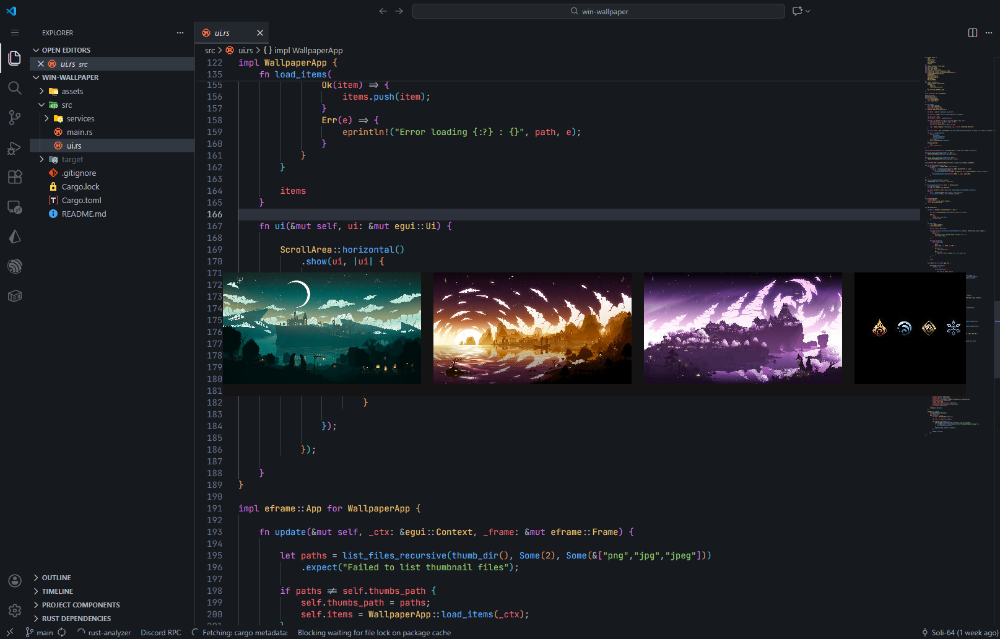

# Windows Wallpaper manager

## A wallpaper manager for windows inpired by wayland full-keyboard ux.

## Put your wallppers in ~/Documents/win-wallpaper/wallpapers

## What's already functionnal:
### - Keyboard shortcut to open / close the app
### - Change wallpaper on click
### - Detect wallpaper from directory and create thumbnails

## Upcoming:
### - Full keyboard UX for changing wallpapers

